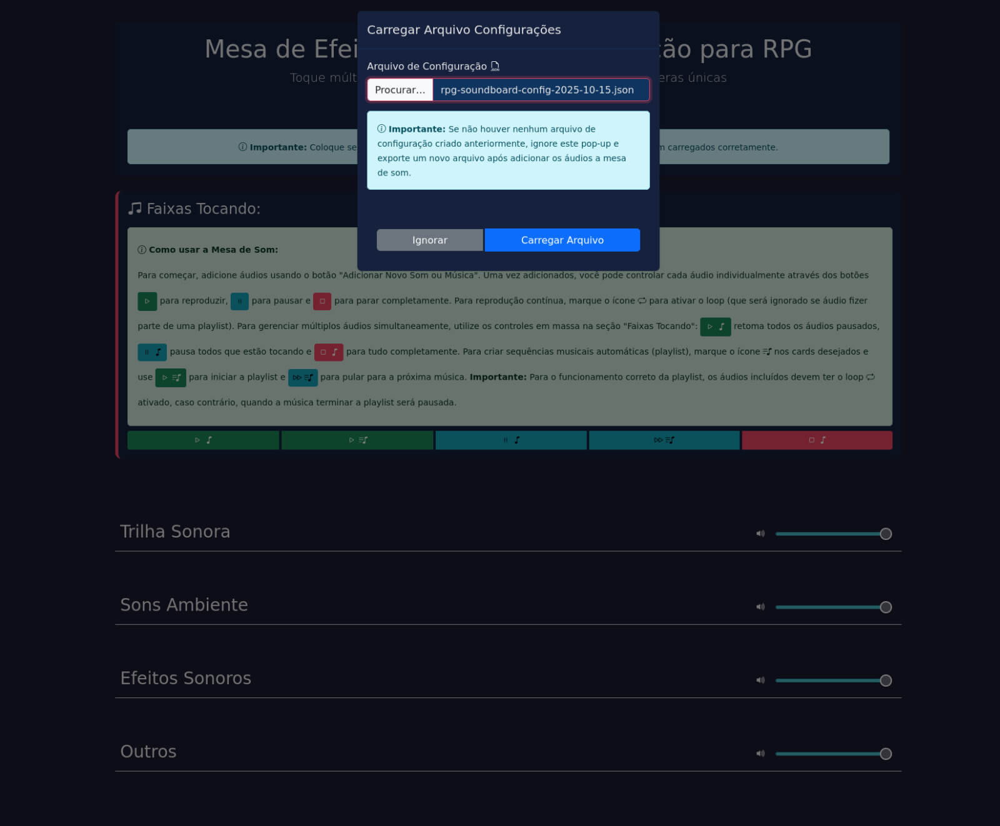
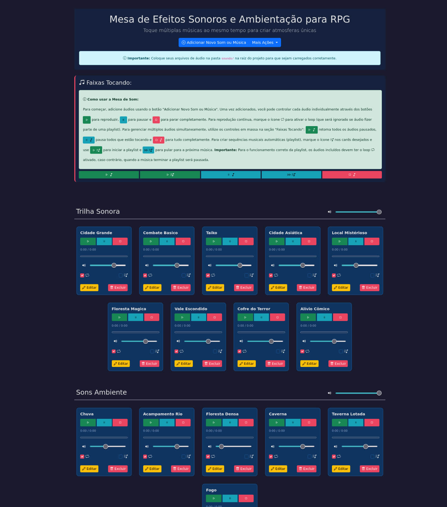
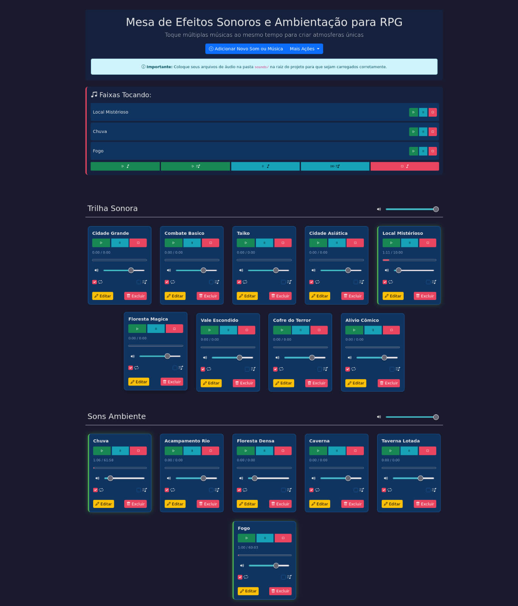
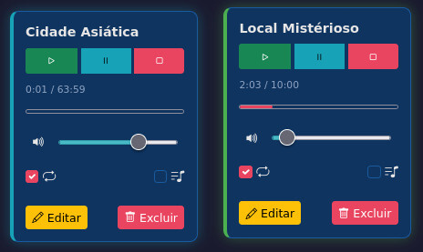
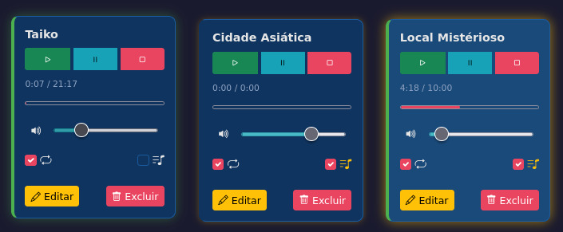

# 🎵 Mesa de Som para RPG - Soundboard Digital

Uma aplicação web para controle de áudios e criação de atmosferas imersivas para sessões de RPG presenciais ou online.

 


## ✨ Funcionalidades Principais

### 🎮 Controles Individuais por Áudio
- **Reproduzir** ▶️ - Inicia o áudio com fade-in suave
- **Pausar** ⏸️ - Pausa com fade-out
- **Parar** ⏹️ - Para completamente e reseta o áudio
- **Controle de Volume** 🔊 - Slider individual para cada som
- **Loop** 🔄 - Reprodução contínua automática
- **Barra de Progresso** 📊 - Visualização do tempo decorrido

### 🎛️ Controles em Massa
- **Play All** ▶️🎵 - Retoma todos os áudios pausados
- **Pause All** ⏸️🎵 - Pausa todos os áudios tocando
- **Stop All** ⏹️🎵 - Para completamente todos os áudios

### 🎵 Sistema de Playlist
- **Adicionar à Playlist** 📝 - Marque sons com o ícone de lista
- **Play Playlist** ▶️📋 - Reprodução sequencial automática
- **Next Track** ⏭️📋 - Pula para o próximo áudio da playlist
- **Indicação Visual** - Cards destacados mostram o status da playlist

### 🗂️ Organização por Categorias
- **Trilha Sonora** 🎼 - Músicas principais e temas
- **Sons Ambiente** 🌲 - Atmosferas e ambientes
- **Efeitos Sonoros** 💥 - Efeitos pontuais e ações
- **Outros** 📦 - Demais áudios

### 💾 Gerenciamento de Configurações
- **Exportar Config** 📤 - Salva toda a configuração em JSON
- **Importar Config** 📥 - Carrega configuração anterior
- **Persistência** 💾 - Mantém sons e configurações

## 🚀 Como Usar

### 1. **Primeiros Passos**


1. Ao abrir a aplicação pela primeira vez:
   - Um pop-up aparecerá para carregar configurações
   - Se não tiver um arquivo salvo, clique em "Ignorar"
   - Adicione seus primeiros sons (veja abaixo)

2. Clique em: [Adicionar Novo Som ou Música]
3. Preencha o formulário:
   - 📝 Título: Nome do áudio (3-20 caracteres)
   - 🎵 Arquivo: Selecione o arquivo de áudio
   - 🗂️ Categoria: Escolha a categoria
   - 🔊 Volume: Defina entre 0 e 1
   - 🔄 Loop: Marque para repetição contínua
4. Clique em [Salvar]


### 2. **Gerenciamento de Configurações**

**Para Exportar**
1. Clique em [Mais Ações] no cabeçalho
2. Selecione [📤 Exportar Configurações]
3. Um arquivo JSON será baixado

**Para Importar**
1. Clique em [Mais Ações] no cabeçalho  
2. Selecione [📥 Importar Configurações]
3. Selecione o arquivo JSON salvo anteriormente
4. Todos os sons e configurações serão restaurados


### 3. **📁 Estrutura de Arquivos**

```
rpg-soundboard/
├── 📄 index.html              # Basta executar este arquivo a magica acontece
├── 🎵 sounds/                 # Coloque seus áudios aqui
│   ├── theme-song.mp3
│   ├── forest-ambience.wav
│   └── sword-clash.ogg
├── 📁 elements/
│   ├── 📁 script/
│   │   ├── 🔊 audio-system.js # Sistema principal de áudio
│   │   ├── 🎯 actions.js      # Renderização e eventos
│   │   ├── ⚙️ config.js       # Gerenciamento de configuração
│   │   ├── 📝 form.js         # Formulários e validações
│   │   └── 💬 alerts.js       # Sistema de notificações
│   └── 🎨 style/
│       └── style.css          # Estilos personalizados
```
<br>
<hr>

🎵 Formatos de Áudio Suportados

    MP3 ✅ (Recomendado para compatibilidade)

    WAV ✅

    OGG ✅

    M4A ✅

    AAC ✅


🔧 Estratégias de Backup

    Exporte regularmente suas configurações

    Múltiplos perfis usando arquivos de configuração diferentes

    Nomes descritivos para facilitar organização

<br>

# 📄 Licençad

Este projeto está sob a licença MIT. Sinta-se à vontade para:

    ✅ Usar em projetos pessoais e comerciais

    ✅ Modificar e adaptar às suas necessidades

    ✅ Distribuir versões modificadas

    ❌ Apenas atribua o crédito original


<hr>

### **Carregando configuração!**



### **Tela inicial**



### **Tocanso trilha sonora e sons ambiente de forma combinada**



### **Indicação de qual áudio está tocando e qual está pausado**



### **Indicação de qual está tocando na lista de reprodução**


